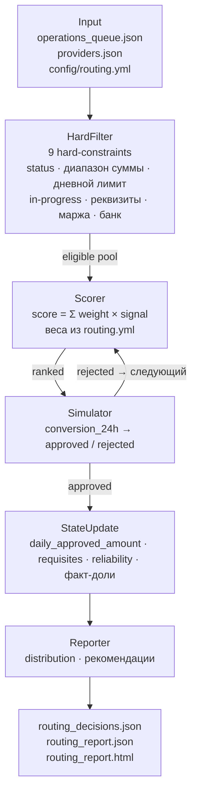

# Умный роутинг выплат · Smart Payout Routing

[](https://github.com/camtimhamilton/hack_genesis/actions/workflows/ci.yml)

-brightgreen)

Кейс **HackGenesis — Задача 2**. Ruby-движок распределения выплат (СБП) между платёжными
провайдерами: жёсткие и мягкие правила, каскадный fallback, объяснимость решений и аналитика.

## Архитектура



## Запуск (одна строка)

```bash
ruby src/main.rb                          # демо → routing_decisions.json + routing_report.json (+ .html)
ruby src/main.rb --deterministic && ruby src/scripts/validate_10.rb routing_decisions.json  # валидация
ruby src/scripts/stress_test.rb           # стресс-тест 10 000 операций
```

## Финал (тестовая очередь)

Когда организаторы пришлют `operations_queue_test.json`, положите его в `src/data/`
(структура совпадает с `operations_queue_10.json`) и выполните одну команду:

```bash
ruby src/main.rb routing_decisions_test.json routing_report_test.json operations_queue_test.json
```

Затем проверьте решения валидатором тестовой очереди:

```bash
ruby src/scripts/validate_test.rb routing_decisions_test.json
```

Артефакты появятся в корне репозитория (ветка `main`) с точными именами:
`routing_decisions_test.json`, `routing_report_test.json` и автономный
`routing_report_test.html` (тот же отчёт, но визуальный — тёмная тема, KPI-карточки,
SVG-графики, таблицы и рекомендации; полностью офлайн, 0 внешних ресурсов).
Валидатор проверяет структуру JSON, покрытие всех заявок, вхождение
`selected_provider` в допустимые, детерминированные кейсы и skip-reasons;
выход `0` = успех.

## Стресс-тест: 10 000 случайных операций (SEED=42)

| Провайдер | Цель traffic | Факт count | Откл. | Доля по объёму | Утилизация лимита |
| --- | --- | --- | --- | --- | --- |
| vipay | 40% | 36.1% | −3.9 пп | 29.4% | 88.3% |
| payflow | 35% | 19.5% | −15.5 пп | 8.4% | 41.9% |
| quickpay | 25% | 34.4% | +9.4 пп | 48.5% | **91.2%** |

- Успешных каскадов (rejected → следующий): **592**
- Переходов на fallback (`spacepayments`): **994**
- Runtime-отказов (rejected/expired): **1677**

## Тесты (unit + spec, только stdlib)

```bash
ruby test/run_all.rb   # все тесты: unit/ (Minitest::Test) + spec/ (Minitest::Spec)
```

- **Unit**: `HardFilter`, `Scorer`, стратегии, `Provider`, `Router`, `Reporter`,
  `Loader`, `Config`, `Simulator`, `RoutingContext`.
- **Spec**: hard-constraints (`spec.md` §5.1), словарь `reason` (§6.1), fallback (§5.4),
  stateful-обновление (§5.5), динамическая надёжность (этап 6).
- Без внешних gem — только stdlib `minitest`, полностью офлайн.

CI (GitHub Actions) прогоняет тесты и валидатор `validate_10.rb` на каждый push/PR.

## Структура проекта

```
src/
├── main.rb               # точка входа: очередь → routing_decisions.json + routing_report.json
├── config/
│   └── routing.yml       # веса стратегий, диапазоны сумм, доопределяемые поля
├── lib/
│   ├── loader.rb         # чтение входных данных
│   ├── provider.rb       # модель провайдера + stateful-метрики
│   ├── hard_filter.rb    # hard-constraints → [ok, reason, details]
│   ├── scorer.rb         # взвешенный скоринг
│   ├── strategies/       # 8 стратегий-плагинов (count_share, volume_share, …, reliability)
│   ├── router.rb         # оркестрация: выбор + fallback
│   ├── simulator.rb      # вероятностный результат по conversion_24h
│   ├── routing_context.rb# накопление факт-долей count/volume
│   └── reporter.rb       # аналитика + рекомендации
│   └── html_reporter.rb  # автономный HTML-отчёт (inline CSS/JS/SVG, офлайн)
├── data/                 # входные данные кейса
└── scripts/
    ├── validate_10.rb    # валидатор демо-очереди
    ├── validate_test.rb  # валидатор финальной тестовой очереди
    ├── test_fallback.rb  # сценарии каскадирования
    └── stress_test.rb    # стресс-тест 10 000 операций
test/
├── run_all.rb            # единый раннер всех тестов (minitest, stdlib)
├── unit/                 # unit-тесты (Minitest::Test)
└── spec/                 # spec-тесты (Minitest::Spec, describe/it)
docs/                     # архитектура, правила, формат, тестирование
.github/workflows/ci.yml  # CI: тесты + валидатор
```

## Почему Clean Architecture

- **Разделение ответственности**: фильтрация (`HardFilter`), выбор (`Scorer` + `strategies`),
  исполнение (`Simulator` / `Router`), учёт (`RoutingContext`), отчёт (`Reporter`) — независимые слои.
- **Правила отделены от кода**: веса и параметры — в `config/routing.yml`; новый провайдер или
  стратегия добавляются без изменения ядра.
- **Стратегии как плагины**: единый интерфейс `score(provider, op, ctx)` — новый фактор = новый файл.
- **Тестируемость**: слои проверяются изолированно (`validate_10.rb`, `test_fallback.rb`, `stress_test.rb`).

## Документация

- [Архитектура](docs/architecture.md)
- [Правила роутинга](docs/routing-rules.md)
- [Формат выходных файлов](docs/output-format.md)
- [Тестирование](docs/testing.md)
- [Как контрибьютить](CONTRIBUTING.md)