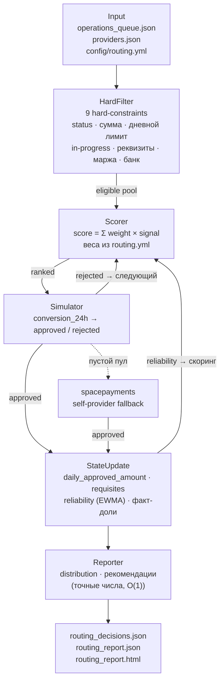
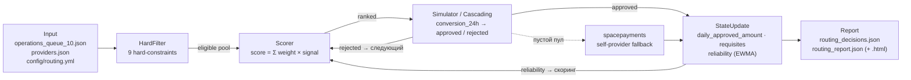

# Умный роутинг выплат · Smart Payout Routing

[](https://github.com/camtimhamilton/hack_genesis/actions/workflows/ci.yml)


Кейс **HackGenesis — Задача 2**. Ruby-движок распределения выплат (СБП) между платёжными
провайдерами: жёсткие и мягкие правила, каскадный fallback, объяснимость решений и аналитика.

## Быстрый старт (Quickstart)

Проект работает на чистом Ruby (stdlib) и **не требует установки сторонних гемов** (`bundle install` не нужен).

```bash
# 1. Запуск роутинга очереди по умолчанию (создает routing_decisions.json и routing_report.json)
ruby main.rb

# 2. Официальная валидация жюри (детерминированный прогон -> 29/29 OK)
ruby main.rb --deterministic && ruby scripts/validate_10.rb routing_decisions.json

# 3. Запуск всех 139+ тестов (Minitest, < 0.1 сек)
ruby test/run_all.rb

# 4. Хаос-тестирование (инъекция сбоев и проверка 100% доставки)
ruby scripts/chaos_test.rb

# 5. Интерактивный дашборд
# Просто откройте routing_report.html в любом браузере (полный офлайн, zero-dependency), без использования runtime нейросетей
```


## Архитектура



### Жизненный цикл операции (Execution Flow)

Поток данных одной операции — слева направо:



1. **Input** — очередь операций, снимок провайдеров и конфиг правил.
2. **HardFilter** — допуск: жёсткие ограничения отсеивают недопустимых → eligible pool.
3. **Scorer** — ранжирование допущенных по взвешенной сумме soft-сигналов.
4. **Simulator / Cascading** — попытка проведения; при `rejected`/`expired` — каскад на следующего по рангу, при пустом пуле — `spacepayments`.
5. **StateUpdate** — обновление stateful-метрик и динамической надёжности (EWMA).
6. **Report** — аналитика, утилизация лимитов и рекомендации (JSON + автономный HTML).

## Запуск (одна строка)

```bash
ruby main.rb                                                                       # демо → routing_decisions.json + routing_report.json (+ .html)
ruby main.rb --deterministic && ruby scripts/validate_10.rb routing_decisions.json # инвариант: валидация демо (exit 0)
ruby test/run_all.rb                                                               # unit + spec (minitest, stdlib)
ruby scripts/stress_test.rb                                                        # стресс-тест 10 000 операций
ruby scripts/chaos_test.rb                                                         # хаос-тест 1 000 операций (инъекция сбоев)
```

## Финал (тестовая очередь)


```bash
ruby main.rb routing_decisions_test.json routing_report_test.json operations_queue_test.json
```

Затем проверьте решения валидатором тестовой очереди:

```bash
ruby scripts/validate_test.rb routing_decisions_test.json
```

Артефакты появятся в корне репозитория (ветка `main`) с точными именами:
`routing_decisions_test.json`, `routing_report_test.json` и автономный
`routing_report_test.html` (тот же отчёт, но визуальный — тёмная тема, KPI-карточки,
SVG-графики, таблицы и рекомендации; полностью офлайн, 0 внешних ресурсов).
Валидатор проверяет структуру JSON, покрытие всех заявок, вхождение
`selected_provider` в допустимые, детерминированные кейсы и skip-reasons;
выход `0` = успех.

## Стресс-тест: 10 000 случайных операций (SEED=42)

| Провайдер | Цель traffic | Факт count | Откл. | Доля по объёму | Утилизация лимита |
| --- | --- | --- | --- | --- | --- |
| vipay | 40% | 36.2% | −3.8 пп | 29.4% | 88.4% |
| payflow | 35% | 19.4% | −15.6 пп | 8.3% | 41.7% |
| quickpay | 25% | 34.4% | +9.4 пп | 48.5% | **91.2%** |

- Успешных каскадов (rejected → следующий): **592**
- Переходов на fallback (`spacepayments`): **994**
- Runtime-отказов (rejected/expired): **1677**

### Бенчмарк

| Показатель | Значение |
| --- | --- |
| Операций | 10 000 |
| Время прогона | ≈ 7.0 c |
| Пропускная способность | ≈ 1 400 оп/с |
| Зависимости | stdlib only, 0 gems |

## Хаос-тест: 1 000 операций с инъекцией сбоев (Chaos Engineering)

`ruby scripts/chaos_test.rb` ломает систему на ходу и доказывает устойчивость:

- **оп 250** — `vipay` падает (`conversion_24h → 0`, шлюз отказывает);
- **оп 600** — у `payflow` обнуляются `available_requisites`.

Результат (SEED=42): **0 потерянных транзакций** (100% обработано), трафик плавно
перетекает на выживший `quickpay` (43.8% → 67.1% → 81.3%) и дефолтный `spacepayments`
(10.0% → 19.7% → 18.7%). Динамическая надёжность `vipay` (EWMA) падает с 0.87 до 0.00
после сбоя, а каскадирование забирает отказ на следующий провайдер без потерь.

## Тесты (unit + spec, только stdlib)

```bash
ruby test/run_all.rb   # все тесты: unit/ (Minitest::Test) + spec/ (Minitest::Spec)
```

- **Unit**: `HardFilter`, `Scorer`, стратегии, `Provider`, `Router`, `Reporter`,
  `Loader`, `Config`, `Simulator`, `RoutingContext`.
- **Spec**: hard-constraints (`spec.md` §5.1), словарь `reason` (§6.1), fallback (§5.4),
  stateful-обновление (§5.5), динамическая надёжность (этап 6).
- Без внешних gem — только stdlib `minitest`, полностью офлайн.

CI (GitHub Actions) прогоняет тесты и валидатор `validate_10.rb` на каждый push/PR.

## Структура проекта

```
main.rb                  # точка входа: очередь → routing_decisions.json + routing_report.json
config/
└── routing.yml          # веса стратегий, диапазоны сумм, доопределяемые поля
lib/
├── loader.rb            # чтение входных данных
├── provider.rb          # модель провайдера + stateful-метрики
├── hard_filter.rb       # hard-constraints → [ok, reason, details]
├── scorer.rb            # взвешенный скоринг
├── strategies/          # 8 стратегий-плагинов (count_share, volume_share, …, reliability)
├── router.rb            # оркестрация: выбор + fallback
├── simulator.rb         # вероятностный результат по conversion_24h
├── routing_context.rb   # накопление факт-долей count/volume
├── reporter.rb          # аналитика + рекомендации
└── html_reporter.rb     # автономный HTML-отчёт (inline CSS/JS/SVG, офлайн)
data/                    # входные данные кейса
scripts/
├── validate_10.rb       # валидатор демо-очереди
├── validate_test.rb     # валидатор финальной тестовой очереди
├── test_fallback.rb     # сценарии каскадирования
├── stress_test.rb       # стресс-тест 10 000 операций
└── chaos_test.rb        # хаос-тест 1 000 операций (инъекция сбоев)
test/
├── run_all.rb           # единый раннер всех тестов (minitest, stdlib)
├── unit/                # unit-тесты (Minitest::Test)
└── spec/                # spec-тесты (Minitest::Spec, describe/it)
docs/                    # архитектура, правила, формат, тестирование
.github/workflows/ci.yml # CI: тесты + валидатор
```

## Почему Clean Architecture

- **Разделение ответственности**: фильтрация (`HardFilter`), выбор (`Scorer` + `strategies`),
  исполнение (`Simulator` / `Router`), учёт (`RoutingContext`), отчёт (`Reporter`) — независимые слои.
- **Правила отделены от кода**: веса и параметры — в `config/routing.yml`; новый провайдер или
  стратегия добавляются без изменения ядра.
- **Стратегии как плагины**: единый интерфейс `score(provider, op, ctx)` — новый фактор = новый файл.
- **Тестируемость**: слои проверяются изолированно (`validate_10.rb`, `test_fallback.rb`, `stress_test.rb`).

## Документация

- [Архитектура](docs/architecture.md)
- [Правила роутинга](docs/routing-rules.md)
- [Формат выходных файлов](docs/output-format.md)
- [Тестирование](docs/testing.md)
- [Как контрибьютить](CONTRIBUTING.md)